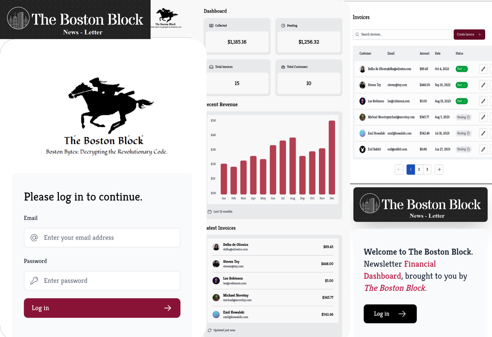

# The Boston Block Invoice Tracker

A full-featured invoicing and payments platform for small businesses in Boston. Built with modern technologies to provide a seamless user experience.



## Table of Contents

- [The Boston Block Invoice Tracker](#the-boston-block-invoice-tracker)
  - [Table of Contents](#table-of-contents)
  - [Description](#description)
  - [Key Features](#key-features)
  - [Technologies](#technologies)
    - [Frontend](#frontend)
    - [Backend](#backend)
    - [Hosting](#hosting)
  - [Getting Started](#getting-started)
    - [Logging In](#logging-in)
    - [Cloning the App](#cloning-the-app)

## Description

The Boston Block Invoice Tracker is a web application designed to simplify invoice management for small businesses in Boston. It offers a range of features to help you track invoices, manage payments, and generate reports for accounting purposes. With its intuitive interface and robust functionality, you can streamline your invoicing process and focus on growing your business.

## Key Features

- User authentication with email and password
- Dashboard for analytics on invoices, customers, and cash flow
- Create and manage customized invoices
- Track payments and balances due
- Export reports for accounting
- Robust customer profiles with payment history

## Technologies

### Frontend

- Next.js for a performant React app
- React.js for components
- Tailwind CSS for responsive design

### Backend

- Node.js runtime
- PostgreSQL database

### Hosting

- Automatic deployments on Vercel

## Getting Started

### Logging In

To try out The Boston Block Invoice Tracker before cloning the app, you can use the following login credentials:

- Username: user@nextmail.com
- Password: 123456

Visit the public homepage of the application and click on the "Login" button. Enter the provided credentials to authenticate yourself and explore the features of the application.

### Cloning the App

To clone The Boston Block Invoice Tracker and run it locally, follow these instructions:

1. Clone the repository from GitHub by running the command:

```bash
  git clone https://github.com/SonnyMonroe/SmallBiz-Financial-Management-Portal.git
```

2. Navigate to the project directory:

```bash
cd SmallBiz-Financial-Management-Portal
```

3. Install the dependencies by running the command:

```bash
   npm install
```

4. Set up the PostgreSQL database and configure the connection settings according to your local environment.

5. Start the development server using the command:

```bash
npm run dev
```

6. Open a web browser and navigate to the local development URL to access the application.

Feel free to explore the codebase, make any necessary modifications, and contribute to the project as you see fit.

Enjoy using The Boston Block Invoice Tracker to streamline your small business invoicing process!

[](https://choosealicense.com/licenses/mit/)


